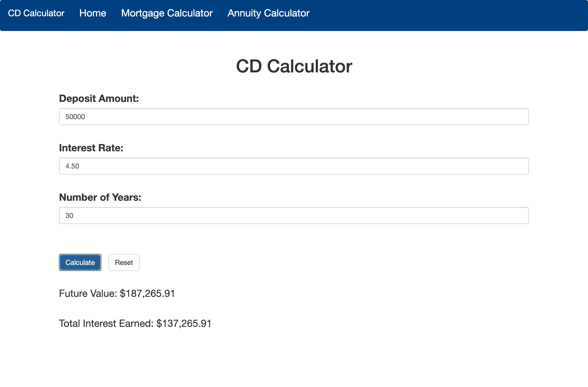

# **TrueNorth Financial Calculator**

The TrueNorth Financial Calculator website provides a set of financial calculators for its clients, The website includes a mortgage calculator, CD calculator and annuity calculator.

## features

- Mortgage calculator: Calculates the monthly payment and total interest for a loan based on the principal, interest rate, and loan length.

- CD calculator: Determines the future value and total interest earned for one time deposits assuming compound interest based on the deposit amount, interest rate, and number of years.

- Responsive design: The website is build with Bootstrap and is responsive to different screen sizes

## images

